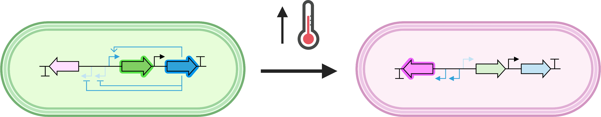

# Xiong-temperature-sensitive-activation
Code for flow cytometry data analysis for Xiong, L. L., Garrett, M. A., Buss, M. T., Kornfield, J. A. &amp; Shapiro, M. G. Tunable Temperature-Sensitive Transcriptional Activation Based on Lambda Repressor. ACS Synth. Biol. (2022) doi:10.1021/acssynbio.2c00093.

